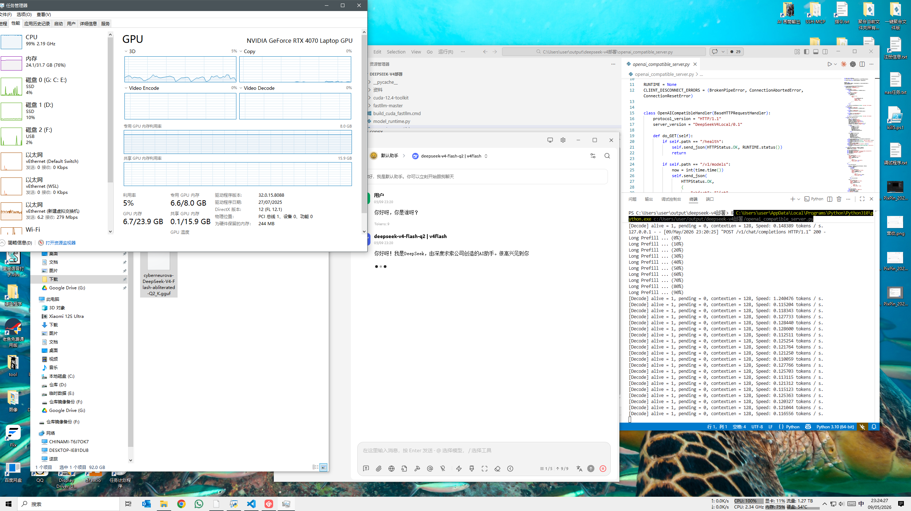
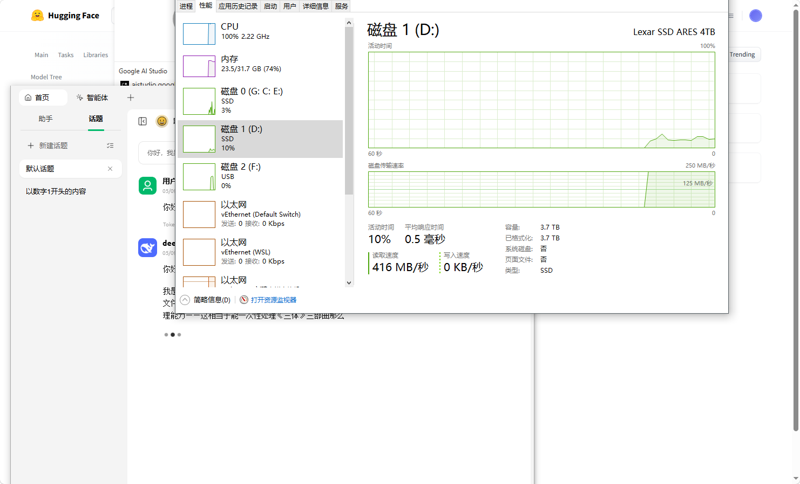
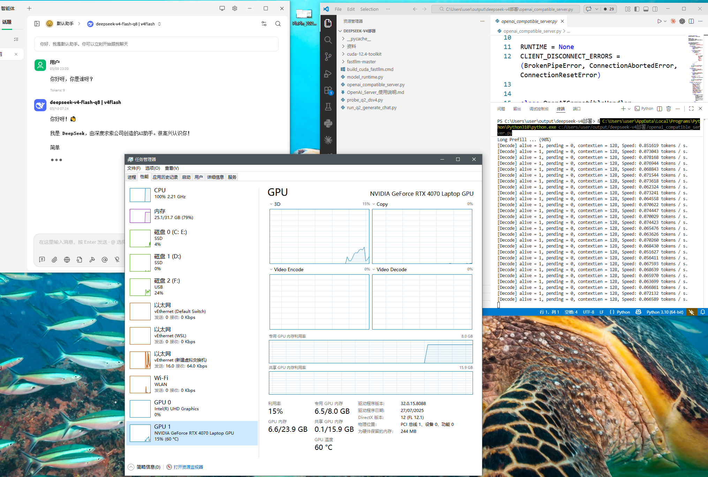
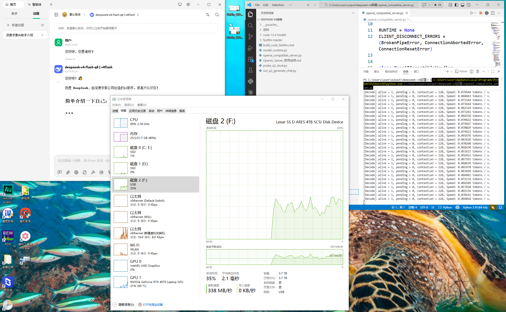

# fastllm Explore

用硬盘来推理 DeepSeek V4 Pro 和 Flash。

本仓库提供一个本地 OpenAI 兼容 server，用于加载 DeepSeek V4 Flash / Pro GGUF 模型并暴露 `/v1` API。

## 说明

这套代码已经在我的电脑上跑通了，我已经完成了模型侧和 server 侧的大部分适配。换到你的电脑上时，通常还需要按本机环境调整模型输入路径、CUDA、GPU 驱动和 fastllm 相关依赖。

建议直接把本仓库交给 Codex，让它根据你的显卡、CUDA 版本和模型文件位置做本地适配。我只保证这套配置在我的电脑上可用；剩下的本机路径和硬件环境，需要在你的机器上重新对齐。

## 硬件与实测成果

测试模型：

- DeepSeek V4 Pro Q4_K_M，21 分片 GGUF，权重约 900GB
- DeepSeek V4 Flash abliterated
- Q8 量化权重约 281G
- Q2 量化权重约 92G

测试硬件：

- GPU: RTX 4070 Laptop 8G
- 内存: 32G DDR5；Flash Q8 实际占用约 8G，Pro Q4_K_M 跑通时会明显吃满内存
- 硬盘: Lexar SSD ARES 4TB PCIe 4.0，标称读速 7000M；早期推理读速约 400M，优化后约 1.2GB/s，峰值约 1.5GB/s
- CPU: Intel i9-13900HS

Flash 实测结果：

- 模型加载约 1 分钟
- Q2: 约 0.12 token/s（早期未优化参考结果）
- Q8 早期基线: 约 0.06 token/s（未优化）
- Q8 当前优化后: 长输出后段约 0.35 token/s，约 6 倍速度提升

Pro Q4_K_M 实测结果：

- 模型目录：`F:\model\DeepSeek-V4-Pro-GGUF-Q4_K_M`
- 21 分片目录已能自动解析到首分片：`deepseek-ai-DeepSeek-V4-Pro-Q4_K_M-00001-of-00021.gguf`
- `loaded_sec: 367.3 秒`
- `model_type: deepseek_v4`
- 验证提示词：`用中文回答两个字：能跑`
- 输出 token 1: `能`
- 输出 token 2: `跑`
- 最终输出：`能跑`

这已经不只是“跑通流程”了。当前版本针对 Windows + NVMe + Disk MoE 做了一轮实打实的优化：并发读、offset ReadFile、热权重缓存、线程参数和本地 OpenAI API 长流式路径都已经打通。Q8 从最早约 0.06 token/s 提升到约 0.35 token/s，更适合一晚上慢慢跑出一篇长文章。优化后推理读盘已经能到约 1.2GB/s，峰值约 1.5GB/s；CPU 占用也下降了，不再必须长期顶到 100%。

另外，当前版本重点修复了 DeepSeek V4 在 128 KV/past cache 边界附近会导致服务端断流的问题。现在长生成不再被这个 bug 提前截断，可以继续压到 KV cache 的真实极限，适合长篇小说这类长输出任务，跑到你存储和 KV cache 能撑住的极限。

更重要的是，DeepSeek V4 Pro Q4_K_M 这个约 900GB 的 21 分片模型已经在这台 8GB 显存、32GB 内存的机器上完成了加载、prefill 和 token 生成。这个结果不是高吞吐聊天服务，而是证明了当前 fastllm 适配已经可以把 Pro 级别的大模型放到 NVMe + 少量显存/内存组合上跑出真实 token。

这次 Pro 跑通做出的取舍：

- 主计算设备使用 CUDA，让 8GB 显存尽量参与计算。
- MoE 权重放到硬盘，避免要求 900GB 权重整体进内存。
- 硬盘 MoE 缓存给到 4096MB，加载线程给到 8，换取可接受的加载推进速度。
- KV cache 限制为 1GB，chunked prefill 压到 2，避免一次性把内存和显存压爆。
- GPU 显存比例设为 0.85，允许显存接近占满，但保留一点系统余量。
- 这不是纯 out-of-core：fastllm 仍然会把密集权重、元数据、KV cache、运行时状态和部分缓存放进 RAM/VRAM。

也试过两个方向。更保守的极限硬盘模式把主设备压到 CPU、硬盘缓存压到 64MB、线程压到 1，内存确实稳，但加载长时间停在 0%，实际不可用。更激进的近乎全量占用配置会让系统进入严重换页，PowerShell 和状态查询都长时间阻塞。当前跑通配置选择的是中间点：愿意吃满可用资源，但不把机器压到完全失控。

Pro 跑通参数：

```text
DSV4_THREADS=8
DSV4_KV_CACHE_LIMIT=1g
DSV4_CHUNKED_PREFILL_SIZE=2
DSV4_GPU_MEM_RATIO=0.85
DSV4_DEVICE_MAP=cuda
DSV4_MOE_DEVICE_MAP=disk
FASTLLM_DISK_MOE_CACHE_MB=4096
FASTLLM_DISK_MOE_LOAD_THREADS=8
```

进程退出时可能看到 CUDA runtime unloading 相关的释放显存报错；它发生在生成完成后的清理阶段，不影响 `能跑` 这个验证结果。

<p>
  
  
</p>

<p>
  
  
</p>

## 方式 A：启动 DeepSeek V4 Flash

在 PowerShell 里进入项目目录：

```powershell
cd D:\AI\LLM\deepseek-v4部署
```

启动 OpenAI 兼容 server：

```powershell
python .\openai_compatible_server.py
```

这条命令会自动做两件事：

1. 加载模型：

```text
D:\AI\LLM\deepseek-v4部署\cyberneurova-DeepSeek-V4-Flash-abliterated-Q8_0.gguf
```

2. 启动本地 OpenAI 兼容 API：

```text
http://127.0.0.1:9000/v1
```

看到类似下面的输出，就说明 server 已经启动：

```text
listening on http://127.0.0.1:9000
openai base url: http://127.0.0.1:9000/v1
```

## 客户端填写

在支持 OpenAI API 的客户端里这样填：

```text
Base URL: http://127.0.0.1:9000/v1
API Key: local
Model: deepseek-v4-flash-q8
```

## 方式 B：启动 DeepSeek V4 Pro Q4_K_M

Pro 模型目录：

```text
F:\model\DeepSeek-V4-Pro-GGUF-Q4_K_M
```

推荐使用已经验证能生成 token 的激进硬盘模式。它只启动 server，不自动加载 21 分片大模型：

```powershell
.\run_deepseek_v4_pro_aggressive_disk.bat
```

检查路径和分片状态：

```powershell
Invoke-RestMethod -Uri http://127.0.0.1:9000/health -Method Get
```

确认 `model_files.missing_files` 为空后，再手动加载：

```powershell
Invoke-RestMethod -Uri http://127.0.0.1:9000/admin/load -Method Post
```

客户端模型名：

```text
deepseek-v4-pro-q4-k-m
```

如果只是诊断路径和分片，不追求马上跑出 token，可以用更保守的入口：

```powershell
.\run_deepseek_v4_pro_extreme_disk.bat
```

## 检查状态

另开一个 PowerShell，执行：

```powershell
Invoke-RestMethod -Uri http://127.0.0.1:9000/health -Method Get
```

如果返回里有：

```text
loaded : True
```

就说明模型已经加载。

## 停止服务

回到运行 server 的 PowerShell 窗口，按：

```text
Ctrl + C
```

server 关闭后，模型也会一起卸载。
